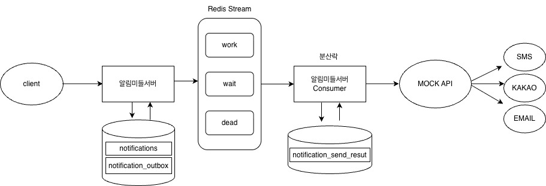
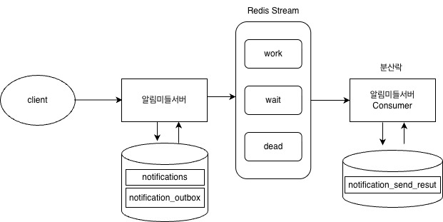
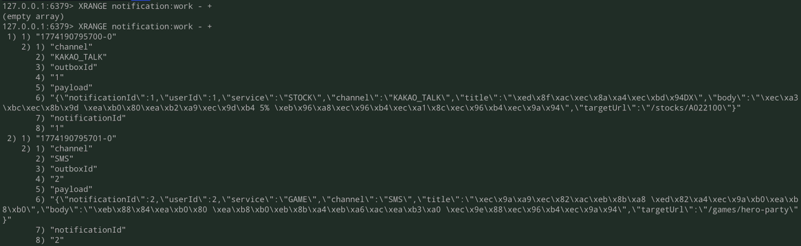
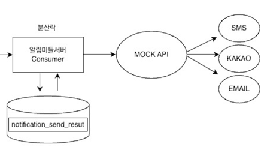
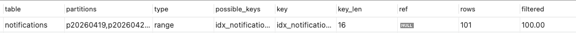

# 알림 발송 미들 서버 개발
### 개요
여러 서비스의 알림 요청을 중앙에서 처리 후, 안정적으로 발송하기 위한 알림 미들 서버 개발

### 아키텍처


### 기술스택
- Java, Spring Boot, H2, Redis(Redis Stream - 메세지 큐 용도), gradle

### API 명세서
| 기능 | Method | URL |
|------|--------|-----|
| 알림 등록 | POST | `/api/notifications` |

### 실행방법
```bash
# Redis 실행
redis-server

# 서버 실행
./gradlew bootRun

# Mock API 실행
./gradlew :mock:bootRun

# 알림 생성 API 호출
curl -X POST http://localhost:8080/api/notifications \
  -H "Content-Type: application/json" \
  -d '{
    "userId": 999,
    "service": "PAYMENT",
    "channel": "EMAIL",
    "title": "정상 발송 테스트",
    "body": "이메일 알림 테스트입니다.",
    "targetUrl": "/payments/concurrency-test"
  }'
```

### 디렉토리 구조
```
notification-service
├── api                  # 외부 요청을 받는 API 계층 
├── app                  # 애플리케이션 실행 모듈
├── application          # 유스케이스, 서비스, 포트 인터페이스
├── domain               # 핵심 도메인 모델
├── infrastructure       # 외부 기술 구현체 
└── scripts              # 테스트/검증용 파이썬 스크립트
```

#### 헥사고날 구조
```
api -> application -> domain
infrastructure -> domain
infrastructure -> application
```

## 1. 알림 발송 등록 API

### 1-1. 아키텍처


### 1-2. Redis Stream 구조 변화
변경 전
```
work 읽음
-> send 호출
-> SUCCESS / FAILED 저장
```
- 문제 : 실패 메세지를 단순히 실패로 처리
  - 일시적인 외부 장애 상황에서도 메세지 유실 가능성 존재
  - 재시도 가능한 실패와 최종 실패를 구분하지 못함

- 해결 방안 : 실패 처리 정책 변경
  - 재시도 가능한 실패 : WAIT로 이동 후 일정 시간 뒤(10초) 재처리
  - 최대 재시도 횟수(3회)를 초과한 실패 : DAED로 이동 후 최종 실패 저장

  
변경 후
```
WORK 읽음
-> send 호출
-> 성공 : SUCCESS 저장
-> 실패 + 재시도 가능 : WAIT 이동

WAIT 읽음
-> nextRetryAt 도달
-> WORK 재투입

WORK 재처리
-> 재시도 횟수(3회) 초과 실패 : DEAD 이동
-> FAILED 저장
```

#### 1-2-1. Redis Stream 데이터

#### 1-2-2. 추가 고려 사항
- 알림발송 중복 방지(멱등성 체크)
  - 가정 : 같은 메세지를 Work에서 두번 읽음, 여러 Consumer가 동시에 같은 메세지를 잡음
  - 적용 : notificationId, channel, status = SUCCESS 조건 조회
  - 문제 : 동시에 여러 Consumer가 같은 메세지 처리하는 상황 발생 가능
    - 조회와 저장사이의 빈틈에서 race condition 발생 가능
    
    <br>
  
- 알림 발송 동시성 제어(분산락 적용)
  - 가정 : 같은 메세지를 거의 동시에 처리(동시성 기반 중복 발송 문제)
  - 적용 : notificationId + channel 기준으로 락 생성
    - 다른 알림들은 병렬처리 + 같은 메세지의 중복 발송만 방지
>Consumer <br>
>락 먼저 획득 -> 멱등성 체크 -> sender 호출 -> 결과 저장/WAIT/DEAD  -> lock 해제

### 1-3. 개선 사항

#### 1-3-1. retryCount추가

- NotificationMessage DTO에만 retryCount 존재 
- 스트림 메시지가 유실되면 재시도 횟수 정보도 함께 유실(운영 추적 어려움)
- 해결 방안 : NotificationSendResult 엔티티에 retryCount 필드 추가

```markdown
기존 구조

[메시지 소비]
   ↓
[락 획득 성공]
   ↓
[중복 발송 여부 확인]
   ↓
[sendSafely() 실행]
   ↓
┌───────────────────────────────────────────────┐
│ SUCCESS                   → DB 저장 후 종료      │
│ FAIL + retry 가능        → WAIT 발행, 저장 안 함   │
│ FAIL + retry 불가        → DEAD 발행 후 저장      │
└───────────────────────────────────────────────┘
```
```markdown
개선 후 구조

[메시지 소비]
   ↓
[락 획득 성공]
   ↓
[중복 발송 여부 확인]
   ↓
[sendSafely() 실행]
   ↓
[result 생성]
   ↓
[DB 저장]  ← 모든 실제 발송 시도 기록
   ↓
┌───────────────────────────────────────────────┐
│ SUCCESS                   → 종료               │
│ FAIL + retry 가능        → WAIT 발행            │
│ FAIL + retry 불가        → DEAD 발행            │
└───────────────────────────────────────────────┘
```

#### 1-3-2. 메시지 유실 문제
```java
public void consumeOnce() {
  List<StreamMessage> messages = notificationMessageStreamReader.readMessages();

  for (StreamMessage streamMessage : messages) {
    NotificationMessage message = notificationMessageDeserializer.deserialize(streamMessage.payload());
    notificationMessageConsumer.consume(message);
    notificationMessageStreamDeleter.delete(streamMessage.recordId()); // 메시지 유실 문제 발생
  }
}
```
문제
- consume() 내부에서 락 획득에 실패하면 메시지 처리 스킵 but 스트림에서는 결과와 무관하게 삭제
  - 처리되지 않은 메시지 유실 문제 발생


구조 개선

| 항목 | 변경 내용 |
|---|---|
| 소비 구조 | 단순 조회/삭제 방식에서 Consumer Group 기반 소비 구조로 변경 |
| 완료 처리 방식 | 무조건 delete 방식에서 결과 기반 Manual Ack 방식으로 변경 |
| 미처리 메시지 관리 | 락 실패 메시지를 삭제하지 않고 PEL에 남기도록 변경 |
| 복구 방식 | PEL에 남은 메시지를 `XPENDING + XCLAIM`으로 reclaim 후 재처리 |
| 멀티 인스턴스 대응 | UUID 기반 consumer name으로 consumer 충돌 가능성 완화 |

#### 1-3-3. 트랜잭션 문제
```java
@transactional
public void publishPendingOutboxes() {
  List pendingOutboxes = notificationOutboxRepository.findAllByStatus(OutboxStatus.PENDING);
  for (NotificationOutbox outbox : pendingOutboxes) {
    notificationMessagePublisher.publish(outbox); // 문제 발생
    outbox.markPublished();
  }
}
```
- DB 트랜잭션과 외부 시스템(Redis 호출)을 한 덩어리로 다루고 있음
  - Redis 호출은 DB 트랜잭션에 포함되지 않는 외부 시스템 호출이므로 롤백 불가능

해결 방향
- 배치 전체 트랜잭션 제거
- Outbox를 건별로 독립 처리하도록 구조 변경
  - 스프링 트랜잭션은 프록시 기반이라, 동일 클래스 내부 메서드 호출(self-invocation)에는 적용되지 않을 수 있어 별도 클래스로 분리


### 1-4. Mock Send API 연동

#### 1-4-1. 아키텍처


#### 1-4-2. 외부 API 연동시 고려 사항
1) 외부 API 장애 대응 구조
   - 외부 API 호출 실패 시 timeout, connect fail, http fail(429/500/503)로 구분해서 저장
2) 호출 제한
   - 429(Too Many Requests) 발생 시, 더 긴 backoff 적용(60s)
3) Circuit Breaker 적용
   - 외부 API 연속 실패 시 추가 호출이 무의미하게 누적되지 않도록 적용
4) Fallback 처리
   - 메인 API에서 timeout, connect fail, 503 같은 장애성 실패 발생시, secondary API로 우회 호출

#### 1-4-3. 채널별 평균 성능 비교
환경 ) MackBook Pro(Apple M1 Pro, 16GB)

고정 ) Vusers : 300, Duration : 3M, 2회 진행, mock mode : ALWAYS_SUCCESS, Errors : 0건
#### 기존 구조
| 채널 | 평균 TPS | 평균 Peak TPS | 평균 응답시간 (ms) |
|------|----------|---------------|--------------------|
| EMAIL | 5,036.2 | 8,812.0 | 52.91 |
| SMS | 7,626.3 | 9,580.8 | 29.61 |
| KAKAO_TALK | 7,522.2 | 9,705.5 | 32.56 |

- 동시 요청 처리 효율을 높이기 위해 가상 스레드 적용 

#### 가상 스레드 적용
고정 ) Vusers : 300, Duration : 3M, 2회 진행, mock mode : ALWAYS_SUCCESS, Errors : 0건

| 채널 | 평균 TPS   | 평균 Peak TPS | 평균 응답시간 (ms) |
|------|----------|--------------|--------------------|
| EMAIL | 5,990.85 | 8,250.25 | 43.16 |
| SMS | 7,747.50  | 9,100.00 | 33.14 |
| KAKAO_TALK | 7,547.35 | 9,169.00 | 34.01 |

```text
Circuit Breaker 설정 
- 초당 약 6,000 ~ 7,700건 요청 처리 기준
- 최근 20건 중 10건 이상 실패 시 장애로 판단
- Open 상태 10초 유지 후 Half-Open에서 5건만 시험 호출해 복구 여부 확인
- 정상 응답 시간이 30 ~ 45ms 수준 -> timeoutDuration : 1s로 설정
```

## 2. 알림 내역 조회 API
요청자별 최근 7일 내역 + 발송 내역 조회

### 2-1. 인덱스 설계
- 데이터: 100,000건

| 구분 | 실행계획 | 의미                                                     |
|---|---|--------------------------------------------------------|
| 인덱스 없음 | `type = ALL`<br>`key = NULL`<br>`rows = 99264`<br>`Extra = Using where; Using filesort` | 전체 테이블을 스캔한 뒤 조건 필터링과 정렬을 별도로 수행                       |
| 단일 인덱스 | `type = ref`<br>`rows = 101`<br>`filtered = 33.33` | `requester_id` 조건 탐색은 빨라졌지만 기간 조건과 정렬은 추가 처리 필요        |
| 복합 인덱스 | `type = range`<br>`rows = 101`<br>`filtered = 100.00`<br>`Extra = Using index condition` | `requester_id`와 `created_at` 범위 조건을 함께 활용해 쿼리 구조에 더 적합 |

- 복합 인덱스 설계 : requester_id 조건 조회와 최근 7일 범위 조회, 최신순 정렬을 함께 처리하기 위해 (requester_id, created_at, id) 순서로 구성
- 복합 인덱스 선택 : 실행계획 비교 결과, 단일 인덱스보다 조회 조건과 정렬 조건을 함께 반영해 쿼리 구조에 더 적합하다고 판단

### 2-2. 페이징 방식 개선

#### 2-2-1. Offset 페이징 한계
- 측정 횟수 : 5회

| OFFSET | 평균 실행 시간 |
|--|--:|
| 0 | 약 0.0767s |
| 80000 | 약 0.1290s |

- OFFSET 값이 커질수록 실행 시간이 증가
- 뒤 페이지로 갈수록 앞선 데이터를 건너뛰는 비용이 커지는 Offset 페이징의 한계를 확인

#### 2-2-2. Cursor 기반 페이징 적용
- 정렬 기준: `createdAt DESC`, `id DESC`
- 커서 기준값: `cursorCreatedAt`, `cursorId`
- 다음 페이지 조건:
    - `createdAt < cursorCreatedAt`
    - 또는 `createdAt = cursorCreatedAt AND id < cursorId`

### 2-3. 일단위 파티셔닝(RANGE)

- 알림 데이터가 계속 누적되어 최근 7일 조회와 오래된 데이터 관리 필요
- `created_at` 기준으로 일 단위 RANGE 파티셔닝 적용