# 알림 발송 미들 서버 개발
### 개요
여러 서비스의 알림 요청을 중앙에서 처리 후, 안정적으로 발송하기 위한 알림 미들 서버 개발

### 아키텍처
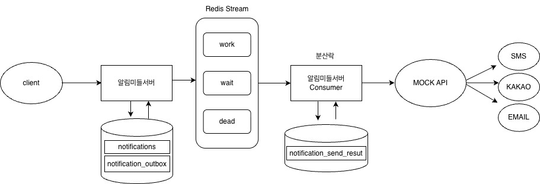

### 기술스택
- Java, Spring Boot, H2, Redis(Redis Stream - 메세지 큐 용도), gradle

### API 명세서
| 기능 | Method | URL |
|------|--------|-----|
| 알림 등록 | POST | `/api/notifications` |
| 요청자별 최근 7일 알림 내역 조회| GET | `/api/notifications/history?requesterId=1&size=20` |

### 실행방법
```bash
# Redis 실행
redis-server

# 서버 실행
./gradlew bootRun

# Mock API 실행
./gradlew :mock:bootRun

# 알림 등록 API 호출
curl -X POST http://localhost:8080/api/notifications \
  -H "Content-Type: application/json" \
  -d '{
    "requesterId": 1001,
    "userId": 2001,
    "service": "PAYMENT",
    "channel": "SMS",
    "title": "결제 완료",
    "body": "결제가 정상적으로 완료되었습니다.",
    "targetUrl": "/payments/123",
    "receiver": "01012345678"
}'
```

### 디렉토리 구조
```
notification-service
├── api                  # 외부 요청을 받는 API 계층 
├── app                  # 애플리케이션 실행 모듈
├── application          # 유스케이스, 서비스, 포트 인터페이스
├── domain               # 핵심 도메인 모델
├── infrastructure       # 외부 기술 구현체 
└── scripts              # 테스트/검증용 파이썬 스크립트
```

#### 헥사고날 구조
```
api -> application -> domain
infrastructure -> domain
infrastructure -> application
```

## 1. 알림 발송 등록 API

### 1-1. 아키텍처
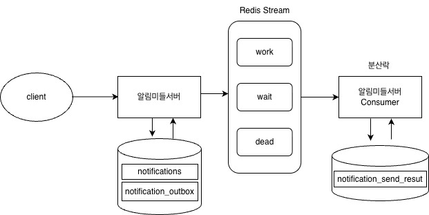

### 1-2. Redis Stream 구조 변화
변경 전
```
work 읽음
-> send 호출
-> SUCCESS / FAILED 저장
```
- 문제 : 실패 메세지를 단순히 실패로 처리
  - 일시적인 외부 장애 상황에서도 메세지 유실 가능성 존재
  - 재시도 가능한 실패와 최종 실패를 구분하지 못함

- 해결 방안 : 실패 처리 정책 변경
  - 재시도 가능한 실패 : WAIT로 이동 후 일정 시간 뒤(10초) 재처리
  - 최대 재시도 횟수(3회)를 초과한 실패 : DAED로 이동 후 최종 실패 저장

  
변경 후
```
WORK 읽음
-> send 호출
-> 성공 : SUCCESS 저장
-> 실패 + 재시도 가능 : WAIT 이동

WAIT 읽음
-> nextRetryAt 도달
-> WORK 재투입

WORK 재처리
-> 재시도 횟수(3회) 초과 실패 : DEAD 이동
-> FAILED 저장
```

#### 1-2-1. Redis Stream 데이터
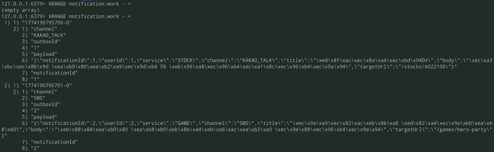
#### 1-2-2. 추가 고려 사항
- 알림발송 중복 방지(멱등성 체크)
  - 가정 : 같은 메세지를 Work에서 두번 읽음, 여러 Consumer가 동시에 같은 메세지를 잡음
  - 적용 : notificationId, channel, status = SUCCESS 조건 조회
  - 문제 : 동시에 여러 Consumer가 같은 메세지 처리하는 상황 발생 가능
    - 조회와 저장사이의 빈틈에서 race condition 발생 가능
    
    <br>
  
- 알림 발송 동시성 제어(분산락 적용)
  - 가정 : 같은 메세지를 거의 동시에 처리(동시성 기반 중복 발송 문제)
  - 적용 : notificationId + channel 기준으로 락 생성
    - 다른 알림들은 병렬처리 + 같은 메세지의 중복 발송만 방지
>Consumer <br>
>락 먼저 획득 -> 멱등성 체크 -> sender 호출 -> 결과 저장/WAIT/DEAD  -> lock 해제

### 1-3. 개선 사항

#### 1-3-1. retryCount추가

- NotificationMessage DTO에만 retryCount 존재 
- 스트림 메시지가 유실되면 재시도 횟수 정보도 함께 유실(운영 추적 어려움)
- 해결 방안 : NotificationSendResult 엔티티에 retryCount 필드 추가

```markdown
기존 구조

[메시지 소비]
   ↓
[락 획득 성공]
   ↓
[중복 발송 여부 확인]
   ↓
[sendSafely() 실행]
   ↓
┌───────────────────────────────────────────────┐
│ SUCCESS                   → DB 저장 후 종료      │
│ FAIL + retry 가능        → WAIT 발행, 저장 안 함   │
│ FAIL + retry 불가        → DEAD 발행 후 저장      │
└───────────────────────────────────────────────┘
```
```markdown
개선 후 구조

[메시지 소비]
   ↓
[락 획득 성공]
   ↓
[중복 발송 여부 확인]
   ↓
[sendSafely() 실행]
   ↓
[result 생성]
   ↓
[DB 저장]  ← 모든 실제 발송 시도 기록
   ↓
┌───────────────────────────────────────────────┐
│ SUCCESS                   → 종료               │
│ FAIL + retry 가능        → WAIT 발행            │
│ FAIL + retry 불가        → DEAD 발행            │
└───────────────────────────────────────────────┘
```

#### 1-3-2. 메시지 유실 문제
```java
public void consumeOnce() {
  List<StreamMessage> messages = notificationMessageStreamReader.readMessages();

  for (StreamMessage streamMessage : messages) {
    NotificationMessage message = notificationMessageDeserializer.deserialize(streamMessage.payload());
    notificationMessageConsumer.consume(message);
    notificationMessageStreamDeleter.delete(streamMessage.recordId()); // 메시지 유실 문제 발생
  }
}
```
문제
- consume() 내부에서 락 획득에 실패하면 메시지 처리 스킵 but 스트림에서는 결과와 무관하게 삭제
  - 처리되지 않은 메시지 유실 문제 발생


구조 개선

| 항목 | 변경 내용 |
|---|---|
| 소비 구조 | 단순 조회/삭제 방식에서 Consumer Group 기반 소비 구조로 변경 |
| 완료 처리 방식 | 무조건 delete 방식에서 결과 기반 Manual Ack 방식으로 변경 |
| 미처리 메시지 관리 | 락 실패 메시지를 삭제하지 않고 PEL에 남기도록 변경 |
| 복구 방식 | PEL에 남은 메시지를 `XPENDING + XCLAIM`으로 reclaim 후 재처리 |
| 멀티 인스턴스 대응 | UUID 기반 consumer name으로 consumer 충돌 가능성 완화 |

#### 1-3-3. 트랜잭션 문제
```java
@transactional
public void publishPendingOutboxes() {
  List pendingOutboxes = notificationOutboxRepository.findAllByStatus(OutboxStatus.PENDING);
  for (NotificationOutbox outbox : pendingOutboxes) {
    notificationMessagePublisher.publish(outbox); // 문제 발생
    outbox.markPublished();
  }
}
```
- DB 트랜잭션과 외부 시스템(Redis 호출)을 한 덩어리로 다루고 있음
  - Redis 호출은 DB 트랜잭션에 포함되지 않는 외부 시스템 호출이므로 롤백 불가능

해결 방향
- 배치 전체 트랜잭션 제거
- Outbox를 건별로 독립 처리하도록 구조 변경
  - 스프링 트랜잭션은 프록시 기반이라, 동일 클래스 내부 메서드 호출(self-invocation)에는 적용되지 않을 수 있어 별도 클래스로 분리


### 1-4. Mock Send API 연동

#### 1-4-1. 아키텍처
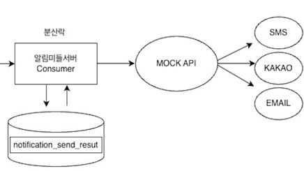

#### 1-4-2. 외부 API 연동시 고려 사항
1) 외부 API 장애 대응 구조
   - 외부 API 호출 실패 시 timeout, connect fail, http fail(429/500/503)로 구분해서 저장
2) 호출 제한
   - 429(Too Many Requests) 발생 시, 더 긴 backoff 적용(60s)
3) Circuit Breaker 적용
   - 외부 API 연속 실패 시 추가 호출이 무의미하게 누적되지 않도록 적용
4) Fallback 처리
   - 메인 API에서 timeout, connect fail, 503 같은 장애성 실패 발생시, secondary API로 우회 호출

#### 1-4-3. 채널별 평균 성능 비교
환경 ) MackBook Pro(Apple M1 Pro, 16GB)

고정 ) Vusers : 300, Duration : 3M, 2회 진행, mock mode : ALWAYS_SUCCESS, Errors : 0건
#### 기존 구조
| 채널 | 평균 TPS | 평균 Peak TPS | 평균 응답시간 (ms) |
|------|----------|---------------|--------------------|
| EMAIL | 5,036.2 | 8,812.0 | 52.91 |
| SMS | 7,626.3 | 9,580.8 | 29.61 |
| KAKAO_TALK | 7,522.2 | 9,705.5 | 32.56 |

- 동시 요청 처리 효율을 높이기 위해 가상 스레드 적용 

#### 가상 스레드 적용
고정 ) Vusers : 300, Duration : 3M, 2회 진행, mock mode : ALWAYS_SUCCESS, Errors : 0건

| 채널 | 평균 TPS   | 평균 Peak TPS | 평균 응답시간 (ms) |
|------|----------|--------------|--------------------|
| EMAIL | 5,990.85 | 8,250.25 | 43.16 |
| SMS | 7,747.50  | 9,100.00 | 33.14 |
| KAKAO_TALK | 7,547.35 | 9,169.00 | 34.01 |

```text
Circuit Breaker 설정 
- 초당 약 6,000 ~ 7,700건 요청 처리 기준
- 최근 20건 중 10건 이상 실패 시 장애로 판단
- Open 상태 10초 유지 후 Half-Open에서 5건만 시험 호출해 복구 여부 확인
- 정상 응답 시간이 30 ~ 45ms 수준 -> timeoutDuration : 1s로 설정
```

## 2. 알림 내역 조회 API
요청자별 최근 7일 내역 + 발송 내역 조회

### 2-1. 인덱스 설계
- 데이터: 100,000건

| 구분 | 실행계획 | 의미                                                     |
|---|---|--------------------------------------------------------|
| 인덱스 없음 | `type = ALL`<br>`key = NULL`<br>`rows = 99264`<br>`Extra = Using where; Using filesort` | 전체 테이블을 스캔한 뒤 조건 필터링과 정렬을 별도로 수행                       |
| 단일 인덱스 | `type = ref`<br>`rows = 101`<br>`filtered = 33.33` | `requester_id` 조건 탐색은 빨라졌지만 기간 조건과 정렬은 추가 처리 필요        |
| 복합 인덱스 | `type = range`<br>`rows = 101`<br>`filtered = 100.00`<br>`Extra = Using index condition` | `requester_id`와 `created_at` 범위 조건을 함께 활용해 쿼리 구조에 더 적합 |

- 복합 인덱스 설계 : requester_id 조건 조회와 최근 7일 범위 조회, 최신순 정렬을 함께 처리하기 위해 (requester_id, created_at, id) 순서로 구성
- 복합 인덱스 선택 : 실행계획 비교 결과, 단일 인덱스보다 조회 조건과 정렬 조건을 함께 반영해 쿼리 구조에 더 적합하다고 판단

### 2-2. 페이징 방식 개선

#### 2-2-1. Offset 페이징 한계
- 측정 횟수 : 5회

| OFFSET | 평균 실행 시간 |
|--|--:|
| 0 | 약 0.0767s |
| 80000 | 약 0.1290s |

- OFFSET 값이 커질수록 실행 시간이 증가
- 뒤 페이지로 갈수록 앞선 데이터를 건너뛰는 비용이 커지는 Offset 페이징의 한계를 확인

#### 2-2-2. Cursor 기반 페이징 적용
- 정렬 기준: `createdAt DESC`, `id DESC`
- 커서 기준값: `cursorCreatedAt`, `cursorId`
- 다음 페이지 조건:
    - `createdAt < cursorCreatedAt`
    - 또는 `createdAt = cursorCreatedAt AND id < cursorId`

### 2-3. 일단위 파티셔닝(RANGE)
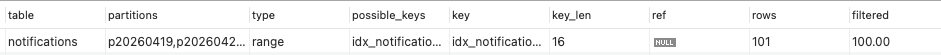
- 알림 데이터가 계속 누적되어 최근 7일 조회와 오래된 데이터 관리 필요
- `created_at` 기준으로 일 단위 RANGE 파티셔닝 적용

### 2-4. 최근 7일 데이터와 과거 데이터 분리

#### 배경
알림 데이터는 시간이 지날수록 계속 누적되기 때문에, 조회가 많은 최근 7일 데이터와 그 이전 데이터를 분리해 관리 필요

#### 구현
- `notifications` 테이블에 일단위 RANGE 파티셔닝을 적용하고, 미래 날짜 파티션은 Scheduler(매일 새벽 1시)를 통해 자동 추가하도록 구성
- 최근 7일 이전 데이터는 Archive DB로 이관하고, 저장이 완료된 데이터는 Main DB에서 삭제하는 방식으로 최근 데이터와 과거 데이터를 분리 관리(매일 새벽 2시)

#### 이슈와 해결
- 구현 과정에서 Main DB와 Archive DB 역할이 섞이며 JPA 초기화와 파티션 생성 대상 DB가 꼬이는 문제 발생
- Main DB는 JPA 전용 datasource, Archive DB는 `JdbcTemplate` 전용 datasource로 분리하고, 스케줄러에는 `mainJdbcTemplate`를 명시 주입

### 3. Codex CLI 코드 리뷰 중 발견한 안정성 이슈
- Codex CLI Plan Mode로 기존 조회/발송 흐름 검토
  - Cursor 입력 검증, Redis Stream Consumer Group 초기화, Outbox 재발행 복구 흐름에서 보완할 지점 확인

|구분          |발견한 문제   |보완 방향 |
|------|----------|--------------|
|Cursor 파라미터       |cursorCreatedAt, cursorId 중 하나만 들어오는 요청 방어 부족 |잘못된 cursor 조합은 400 응답 |
|Consumer Group 초기화 |Stream 또는 Group이 없는 상태에서 소비 시작 시 예외 가능   |Stream/Group 존재 여부 확인 후 초기화|
|Outbox 재발행 복구    |PUBLISHED 상태지만 실제 발송 결과가 없는 메시지 복구 필요  | send_result 없는 outbox 재발행 |

### 3-1. Cursor 파라미터 검증

#### 문제
- 정상 요청 <br>
_cursorCreatedAt + cursorId_
-> 특정 시점 + 특정 row 이후 데이터 조회

- 잘못된 요청 <br>
_cursorCreatedAt만 있음_
-> 같은 시간대 데이터 중 어디서부터 조회할지 불명확 <br>
_cursorId만 있음_
-> 생성 시각 기준 없이 ID만으로 커서 조회


**Redis Global Cache 적용 시, 잘못된 cursor 값이 조회 조건뿐 아니라 Cache Key 생성에도 반영될 수 있음** 


> 잘못된 Cursor 요청 -> 잘못된 DB 조회 조건 생성 -> 잘못된 Cache Key 생성 가능 -> 캐시 기준이 불명확해질 위험

#### 해결 방안
|항목             | 변경 전        |변경 후  |
|------|----------|--------------|
| Cursor 검증     | 일부 누락된 cursor 조합 방어 부족     | 둘 중 하나만 전달되면 예외 처리       |
| 첫 페이지 조회   | cursor 없이 조회                    | 기존처럼 허용                     |
| 다음 페이지 조회 | cursor 조합 검증이 명확하지 않음        | cursorCreatedAt + cursorId 함께 필요 |
| 예외 처리        | 잘못된 값이 조회 로직까지 전파 가능     | InvalidCursorException 발생 후 400 응답|
| 캐시 키 안정성   | 잘못된 cursor 값이 key에 반영될 수 있음 | 검증된 요청만 Cache Key 생성            |

_Redis Global Cache를 적용하기 전에 조회 API의 입력 경계를 먼저 정리하면서, 캐시 키 설계를 더 안정적으로 가져갈 수 있음_

### 3-2. Redis Stream Consumer Group 초기화 보완

#### 문제
- Redis Stream 소비 구조는 Consumer Group을 전제로 동작
- 앱 시작 시점에 Stream 또는 Consumer Group이 항상 존재한다고 보장할 수 없음
- 앱 실행 <br>
Consumer Group 기반 XREADGROUP 수행
-> Stream 또는 Group이 없으면 NOGROUP 예외 발생 가능
- 기존 구조에서는 Stream/Group 초기화 상태에 따라 메시지 소비 스케줄러가 예외를 만날 수 있음

#### 해결 방안
| 항목           | 변경 전     |변경 후    |
|------|----------|--------------|
| Stream 존재 여부 | 소비 시점에 존재한다고 가정    | 없으면 bootstrap record로 Stream 생성 |
| Consumer Group | 이미 생성되어 있다고 가정      | 없으면 Group 생성                 |
| 중복 초기화      | BUSYGROUP 예외 가능         | 이미 있으면 정상 상태로 간주    |
| 소비 안정성      | 초기화 상태에 따라 NOGROUP 가능 | 초기화 후 소비 가능          |

- Stream/Group 확인 <br>
  - Stream 없음: bootstrap record 추가
  - Group 없음: Consumer Group 생성
  - 이미 존재: 그대로 진행

#### 결과

- 앱 실행 시 Redis Stream 상태가 비어 있어도 Consumer Group 기반 소비가 시작될 수 있도록 초기화 흐름을 보완
- 운영 환경에서 Redis 데이터가 초기화되거나 새 환경에 배포되는 경우에도 메시지 소비 시작 조건을 더 명확하게 만듦

### 3-3. Outbox 기반 유실 메시지 재발행 복구

#### 문제
- 중간 실패 케이스 발견
  - Outbox 상태 PUBLISHED -> Redis Stream 발행 성공으로 간주 -> 하지만 send_result 없음 -> 실제 발송 처리 여부 확인 불가
- 이 상태가 지속되면, outbox는 이미 발행된 것으로 표시되어 다시 처리되지 않고 메시지가 유실된 것처럼 남을 수 있음

#### 해결 방안
- PUBLISHED 상태지만, 발송 결과가 없는 outbox를 복구 대상으로 판단

|조건             | 의미                       |
|------|----------|
| Outbox status = PUBLISHED |발행 완료로 표시된 outbox  |
|send_result 없음         | 실제 발송 처리 결과가 없음    |
|grace period 초과         |아직 처리 중일 가능성을 기다린 뒤 복구 |

- PUBLISHED outbox 조회
  + send_result 없음
  + grace period 초과
    -> Redis Stream 재발행
- 재발행 성공 -> outbox 상태는 PUBLISHED 유지
- 재발행 실패 -> 로그 기록 -> 다음 outbox 계속 처리

#### 결과
- 이 방식은 기존 구조를 크게 변경하지 않고(유실 방지를 우선으로 생각) 적용할 수 있는 최소 복구 방안
- 현재 방식은 Outbox 자체에서 **재발행 횟수, 마지막 재발행 시각**을 명확히 추적하지는 않음
- 장기적으로는 Outbox를 단순 발행 기록이 아니라, **처리 상태를 추적하는 형태**로 확장하는 방향 고려
  - PUBLISHED, COMPLETED, DEAD 등 상태 세분화
  - 재발행 판단(createdAt + grace period -> publishedAt, lastPublishedAt 기준)
  - 처리 완료 추적(send_result 존재 여부로 판단 ->Consumer 처리 후 Outbox를 COMPLETED로 변경)


## 4. 요청자별 알림 내역 조회 캐시 레이어 이중화
#### 가정
- 관리자 페이지에서는 특정 요청자의 알림 발송 이력을 반복적으로 확인할 가능성이 높음
- 운영자가 장애 문의나 발송 이슈를 확인할 때, 동일 요청자에 대한 최근 알림 내역을 짧은 시간 안에 여러 번 조회할 수 있음
### 4-1. Redis Global Cache 적용

#### 조회 흐름
- 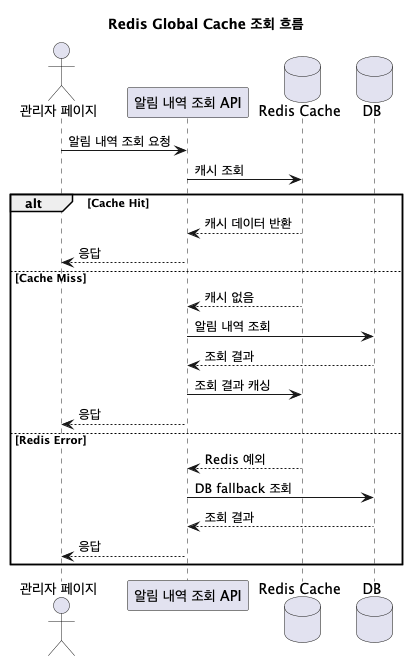

### 4-2. Redis timeout 설정
- Redis 장애가 기능 실패로 전파되지는 않더라도 API 응답 지연으로 전파될 수 있음

| 설정                         | 의미 | 설정 이유|
|----------------------------|----------|---------|
| connect-timeout: 500ms	    |Redis 연결 대기 시간|연결 자체가 오래 걸리면 빠르게 실패 처리|
| timeout: 3s                | Redis command 대기 시간|Redis Stream blocking read와 충돌하지 않도록 조정|
| shutdown-timeout: 100ms    |애플리케이션 종료 시 Lettuce 종료 대기 시간|종료 시 불필요한 장시간 대기 방지|

- Redis Cache는 fail-open 구조를 유지하면서, Redis 지연이 API 전체 응답 지연으로 길게 전파되는 것을 제한
### 4-3. Local Cache 적용

#### 조회 흐름
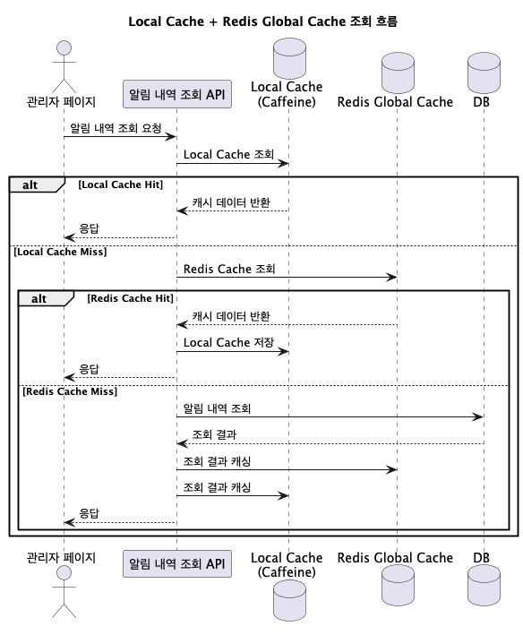
- Redis 앞단에 Caffeine 기반 Local Cache를 추가

| 설정                         | 값     | 
|----------------------------|-------|
|Redis TTL| 60s   |
|Local TTL| 10s   |
|maximum-size| 10000 |

### 4-4. Redis command timeout 조정

#### 문제
- 초기 : Redis command timeout을 1s로 설정
  - 앱 실행 중 Redis Stream XREADGROUP에서 timeout이 발생
- 원인 : Redis Cache와 Redis Stream이 같은 RedisConnectionFactory를 공유

> spring.data.redis.timeout = 1s <br>
> Redis Stream XREADGROUP block timeout = 2s  <br>
> 정상적으로 2초 대기해야 하는 Stream read가 1초 후 command timeout으로 실패

#### 개선
- Redis command timeout을 Stream blocking read 시간보다 길게 조정

  |항목	|변경 전	|변경 후|
  |------------|----------------------|-------|
  |Redis command timeout	|1초	|3초|
  |XREADGROUP block timeout|	2초|	2초|
  |결과|	정상 대기 중 timeout 발생 가능|	Stream read 대기 가능|

#### 결과
- 현재 구조에서는 Cache와 Stream이 같은 Redis 설정을 공유하기 때문에, command timeout을 Stream block timeout보다 길게 설정
- 장기적으로는 Cache와 Stream의 timeout 요구사항이 다르기 때문에 RedisConnectionFactory를 용도별로 분리하는 방향이 더 적절하다고 판단


### 4-5. 부하 테스트 결과 비교
- Local 환경에서는 애플리케이션 서버와 Redis를 분리된 서버 환경으로 구성하지 않았기 때문에, Redis network in/out 지표를 통해 서버 간 네트워크 비용 감소를 직접 비교하기는 어려움
- 따라서 Redis 접근량 자체를 확인하기 위해 `Redis GET command 수`를 핵심 지표로 사용
- 테스트 조건
  - VUser : 100
  - 테스트 시간 : 60s
  - 요청 URL : /api/notifications/history?requesterId=1&size=20

#### 결과
|확인 지표|Redis Global Cache only|Local Cache + Redis Global Cache|
|------------|----------------------|-------|
|Redis GET command 수 |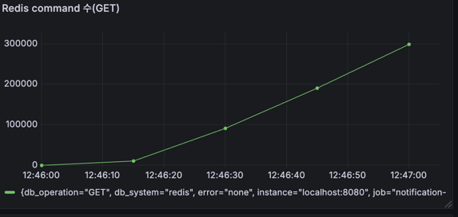|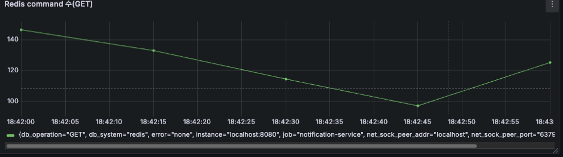|
|Local Cache Hit / Miss	| - |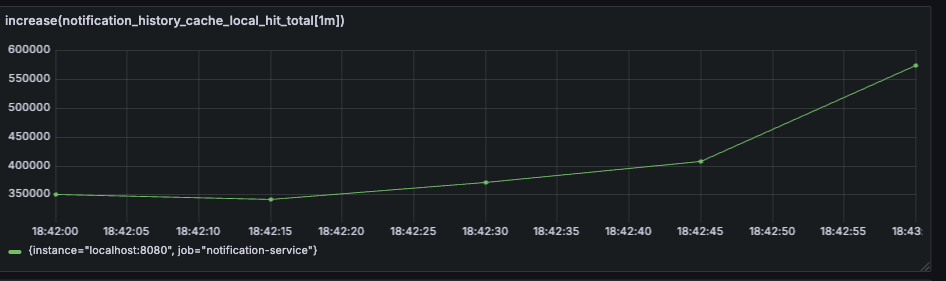|
|DB 조회 수 |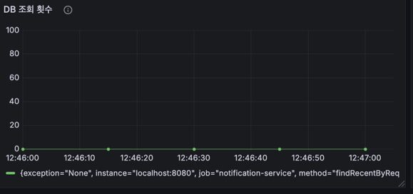|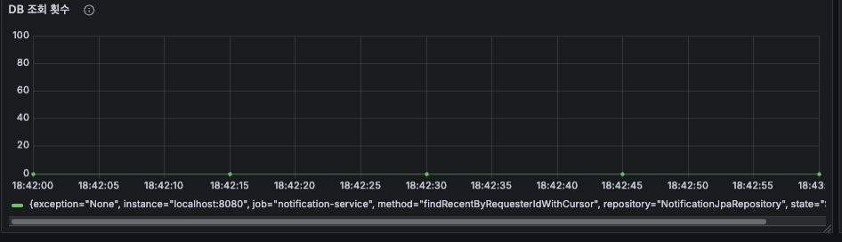|

- Redis GET command 수는 약 120~150건 수준으로 감소
  - Redis Global Cache only 대비 Redis GET 요청이 약 99.9% 이상 감소
- Redis Global Cache는 DB 조회 부하를 줄이는 역할을 하고, Local Cache는 Redis 접근량을 줄이는 역할을 함
